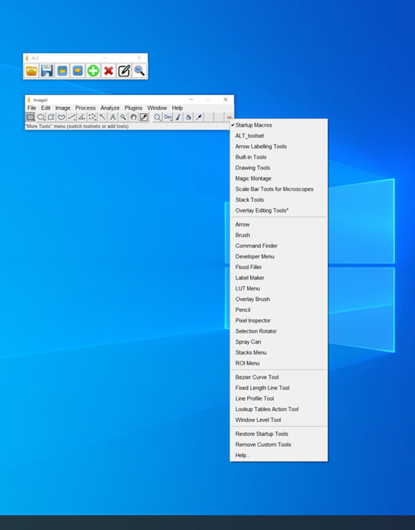

### ALT4OCR
- updated Alp's Labeling tool for OCR(character annotation)
- Original ALT is here (https://alpslabel.wordpress.com/2017/01/26/alt/)
### Install 
1. Install ImageJ (https://imagej.nih.gov/ij/download.html) and start 
2. Install ActionBar Plugin (https://imagejdocu.tudor.lu/doku.php?id=plugin:utilities:action_bar:start)
3. Copy this repository under Plugin>ActionBar folder 
   - If there is not ActionBar folder under ImageJ>Plugins, create it    
   -[option] If you want to use keyboard short cut, move ALT_toolset.txt to ImageJ/macro/toolsets/    
4. register this actionbar macro as auto run 
4.1 Click Edit > Options > Startup   
4.2 Paste this command  
```
     run("Action Bar","/plugins/ActionBar/ALT.txt");  
```
5. restart ImageJ 

6. [option] If you want use keyboard short cut
   6.1 click "More Tools" > ALT_toolset

   


### How to use
0. Annotation file format : txt file with same file name  
   
  [label]Tab[X0]Tab[Y0]Tab[X1]Tab[Y1]Tab[X2]Tab[Y2]Tab[X3]Tab[Y3][NewLine]

1. Supported command 
   
| command  |              Icon              | short cut | description                                                                                        |
| -------- | :----------------------------: | :-------: | :-------------------------------------------------------------------------------------------- |
| `open`   |      |     o     | open image file to annotate                                                                 |
| `save`   |      |     s     | save annotation                                                                               |
| `prev`   |      |     o     | open previous image without save current annotation                                           |
| `next`   |      |     o     | open next image without save current annotation                                               |
| `add`    |        |     a     | add new annotation for current selection                                                    |
| `delete` |  |     d     | delete selected annotation                                                                    |
| `edit`   |      |     e     | edit selected region's label                                                                  |
| `find`   |      |     f     | make selected region flickering (use this function after select label in Roi Manager window) |

### Tip
If you want read utf-8 label file in windows 10, change imageJ.cfg like this
```
.
jre\bin\javaw.exe
-Dfile.encoding=UTF8 -Xmx24540m -cp ij.jar ij.ImageJ 
```
